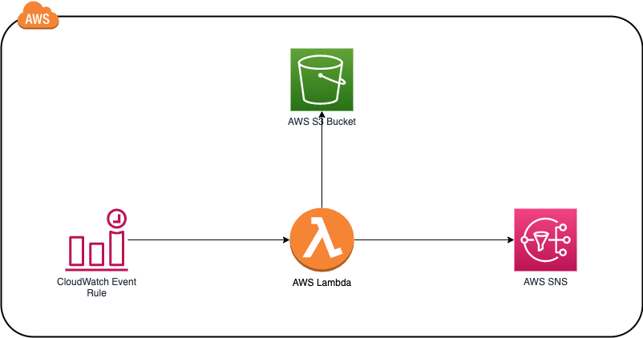

# Parquet Merge Lambda

When you have the problem that you have to store parquet files in a short time frame to S3, this could lead to lot of small files which could gives you a bad performance in Athena.
In this use case it could make sense to merge the files in bigger files with a wider time frame.

For Python there are two major Libraries for working with Parquet files:

* [PyArrow](https://pypi.org/project/pyarrow/)
* [FastParquet](https://pypi.org/project/fastparquet/)

When using PyArrow to merge the files it produces a parquet which contains multiple row groups, which decrease the performance at Athena. FastParquet merge files in the right manor by creating only one row group, but has the problem that the Library is larger then the 250MB file size limit at Lambda.

To get FastParquet deployed to Lambda we have to do some magic while building the Lambda Package with [SAM](https://docs.aws.amazon.com/serverless-application-model/latest/
eveloperguide/what-is-sam.html).

## Why PyArrow merge is bad

Install Parquet-Tools:
```bash
brew install parquet-tools
```

When we are using our test skript which uses [PyArrow](./tests/pycharm/pycharm_merge.py) and we are checking the meta-data with Parquet-Tools we will get following output

```bash
cd tests/pycharm
parquet-tools meta combined.parquet
...
row group 1:       RC:1000 TS:59293 OFFSET:4
--------------------------------------------------------------------------------
registration_dttm:  INT64 GZIP DO:4 FPO:5901 SZ:7244/9301/1.28 VC:1000 ENC:RLE,RLE_DICTIONARY,PLAIN ST:[min: 1454457660000000000, max: 1454543995000000000, num_nulls: 0]
...

row group 2:       RC:1000 TS:59293 OFFSET:60419
--------------------------------------------------------------------------------
registration_dttm:  INT64 GZIP DO:60419 FPO:66316 SZ:7244/9301/1.28 VC:1000 ENC:RLE,RLE_DICTIONARY,PLAIN ST:[min: 1454457660000000000, max: 1454543995000000000, num_nulls: 0]
...
```

Which means that PyArrow is just adding additionals parquet files at table level and creating a combined with with multiple row groups. This is very inefficient as we loose the power of column groups etc.

While looking at our output from this merge tool leaveraging FastParquet we will see following:

```bash
cd tests/data
parquet-tools meta merged-0.parquet
...
row group 1:       RC:2000 TS:315775 OFFSET:4
--------------------------------------------------------------------------------
registration_dttm:  INT64 UNCOMPRESSED DO:0 FPO:4 SZ:16037/16037/1.00 VC:2000 ENC:PLAIN,RLE,BIT_PACKED ST:[min: 2016-02-03T00:01:00.000000, max: 2016-02-03T23:59:55.000000, num_nulls: 0]
...
```

Not loosing the power of column storages and speeding up queries in Athena instead of increasing the query times when using the PyCharm merge.

## Architecture



## Deploy the application

To deploy the application, you need the following tools.

* SAM CLI - [Install the SAM CLI](https://docs.aws.amazon.com/serverless-application-model/latest/developerguide/serverless-sam-cli-install.html)
* [Python 3 installed](https://www.python.org/downloads/)
* Docker - [Install Docker community edition](https://hub.docker.com/search/?type=edition&offering=community)

To build and deploy your application for the first time, run the following in your shell:

```bash
sam build
sam deploy --guided
```

The first command will build the source of your application. The second command will package and deploy your application to AWS, with a series of prompts:

* **Stack Name**: The name of the stack to deploy to CloudFormation. This should be unique to your account and region, and a good starting point would be something matching your project name.
* **AWS Region**: The AWS region you want to deploy your app to.
* **Parameter S3BUCKET**: The S3 Bucket which contains the parquet files, no folder needed as the lambda iterates through all folders
* **Parameter TTLMINUTES**: The merge function doesn't merge files which are newer than the current time minues the value in TTL_MINUTES
* **Parameter SNSEMAIL**: Email address which gets informed on failures
* **Parameter RULECRON**: Cron or Rate expression for the Cloudwatch Event Rule ([docs](https://docs.aws.amazon.com/AmazonCloudWatch/latest/events/ScheduledEvents.html))
* **Parameter MEMORYSIZE**: Memory Size of the Lambda Function (min: 64MB, max: 3008MB, increment in 64MB steps, default 256MB)
* **Confirm changes before deploy**: If set to yes, any change sets will be shown to you before execution for manual review. If set to no, the AWS SAM CLI will automatically deploy application changes.
* **Allow SAM CLI IAM role creation**: Many AWS SAM templates, including this example, create AWS IAM roles required for the AWS Lambda function(s) included to access AWS services. By default, these are scoped down to minimum required permissions. To deploy an AWS CloudFormation stack which creates or modified IAM roles, the `CAPABILITY_IAM` value for `capabilities` must be provided. If permission isn't provided through this prompt, to deploy this example you must explicitly pass `--capabilities CAPABILITY_IAM` to the `sam deploy` command.
* **Save arguments to samconfig.toml**: If set to yes, your choices will be saved to a configuration file inside the project, so that in the future you can just re-run `sam deploy` without parameters to deploy changes to your application.

You can find your API Gateway Endpoint URL in the output values displayed after deployment.

## Test

For testing purpose there are two sample parquet files in *tests/data* which you could copy to your S3 Bucket Folder.

## Cleanup

To delete the sample application that you created, use the AWS CLI. Assuming you used your project name for the stack name, you can run the following:

```bash
aws cloudformation delete-stack --stack-name merge-parquet
```

## Resources

See the [AWS SAM developer guide](https://docs.aws.amazon.com/serverless-application-model/latest/developerguide/what-is-sam.html) for an introduction to SAM specification, the SAM CLI, and serverless application concepts.

Next, you can use AWS Serverless Application Repository to deploy ready to use Apps that go beyond hello world samples and learn how authors developed their applications: [AWS Serverless Application Repository main page](https://aws.amazon.com/serverless/serverlessrepo/)
